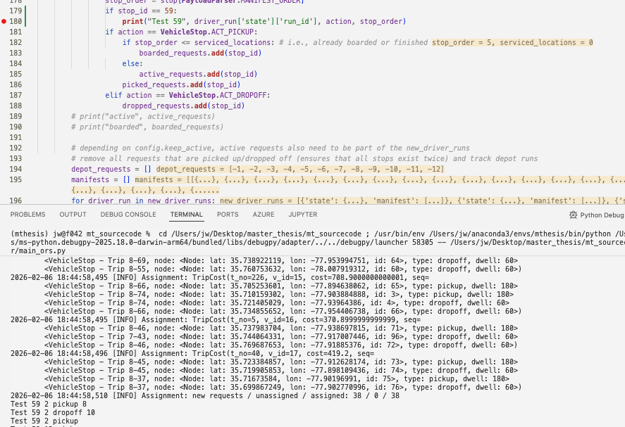

# Major problems
## Solution is indeterministic but I cannot pinpoint it (what could change the vehicleAssignment?)
Context: Different requests seem to be picked up under the same arguments

## Dropoff window in `wilson / rh-ml` fixed in payload
Context: Dropoff window is defined in the payload, this should be overwritten in the code based on our own definition of waiting times that we want to consider. -> do a single run over all the requests to fix this problem once?

## Error: Sometimes requests are lost
Following settings lead to a breaking run in check_consistency_of_manifests
Reproducible settings: with wilson_data, cardinality = 3, thread_cnt = 16, batch_interval = 1800, step_size = 1800 (should be reproducible with this)

## Re-optimize if one vehicle has dropped off their steps (major effort)
Currently, the optimization is built in order to create all RTV combinations (up to max_cardinality) defined at the beginning and run optimize this once. This leads to the weird behavior that a longer batch_size with more requests maxes out the capacity of the vehicle up to max_cardinality but smaller increments of batch_size are able to serve more requests as they run the same optimization twice during that time.

# Improvements
- fix return_depot
- fix rebalancing (not as important in current setup)
- add automatic JSON logger for behavior of trip Generation etc
- store config in separate file and make runs (training) reproducible
- add feature to tag vehicles as "inactive" in contrast to "started" and only calculate trip Generation with active vehicles when they are not used anymore
- update payload_object.current_time in order to be able to use it properly
- check TODO, FIXME, NOTE in the code
- move all arguments required for a run into the .args file and store it with logs of a run (currently only debug mode is always fixed and it is not entirely cleared)   
- time which effects cardinality and threads have on the performance of the code (should lead to a note which process we really need to improve with and do we rather want short batch_intervals or just short steps)
- update README.md and combine information from documentation.md (SSOT) incl. installation and building
- ensure that one can still build a python package from it without setup.py and use pyproject.toml more usefully
- export a requirements.txt and integrate to pyproject.toml
- when breaking RTV generation time, break off new generation but still optimize to keep it running but with a warning in the stats that it did not run to optimality

How can one trip be assigned to the same trip twice?
